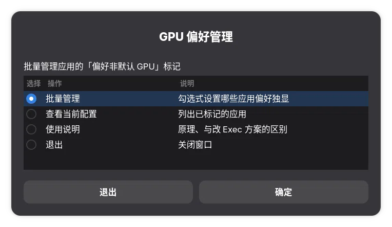
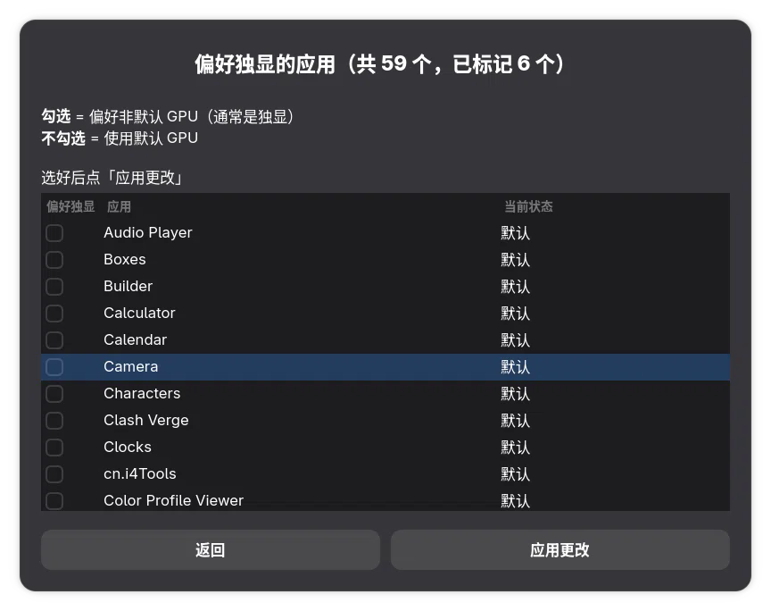

# gpu-pref-manager

批量管理linux桌面上的应用的「偏好非默认 GPU」标记 —— 基于 **freedesktop 标准**，适用于gnome，kde的.desktop快捷方式

还在一个个右键桌面上的应用「使用独立显卡启动」吗？这个工具让你**一次勾选、永久生效**。

## 它到底做什么

往应用的 `.desktop` 文件里写**一行标准键**：

```ini
[Desktop Entry]
Name=Steam
Exec=/usr/bin/steam %U
PrefersNonDefaultGPU=true        ← 就是这一行
```

这是 **freedesktop Desktop Entry Specification 1.4** 定义的字段：

> `PrefersNonDefaultGPU`: If true, the application prefers to be run on a more powerful discrete GPU if available.

GNOME 和 KDE 都会读取它

## 截图

主菜单：



勾选式批量管理 —— 多个应用一次配完：



## 特性

- **纯标准方案** —— 只写一个规范定义的键，零私有机制
- **不碰系统文件** —— 只写 `~/.local/share/applications/`
- **勾选式批量管理** 
- **附带命令行模式** —— 可脚本化、便于排障
- **会自检桌面支持** —— 启动时检测当前版本GNOME/KDE 是否实现了该键。
- **变更前二次确认** —— 防止误操作清空全部标记

## 依赖

| 依赖 | 必需性 |
|---|---|
| `bash` ≥ 4.0 | 必需 |
| `zenity` | 图形界面必需 |
| `desktop-file-utils` | 推荐（提供 `update-desktop-database`）|

```bash
# Fedora
sudo dnf install zenity desktop-file-utils
# Debian / Ubuntu
sudo apt install zenity desktop-file-utils
# Arch
sudo pacman -S zenity desktop-file-utils
```

> **KDE 用户**：KDE 默认用 `kdialog`，需要额外装 `zenity` 才能用图形界面。

## 安装

```bash
./install.sh                              # 装到 ~/.local/bin
./install.sh --prefix /usr/local/bin      # 自定义位置
```

或直接跑，不安装：

```bash
bash gpu-pref-manager.sh
```

## 用法

### 图形界面

```bash
gpu-pref-manager
```

主菜单：

| 菜单项 | 作用 |
|---|---|
| **批量管理** | 勾选式设置哪些应用偏好独显 |
| **查看当前配置** | 列出已标记的应用 |
| **使用说明** | 原理与限制 |

### 命令行

```bash
gpu-pref-manager --list           # 列出已标记的应用
gpu-pref-manager --all            # 列出全部应用及标记状态
gpu-pref-manager --on steam hmcl  # 为指定应用加上标记
gpu-pref-manager --off steam      # 移除标记
gpu-pref-manager --check          # 检查环境与桌面支持
gpu-pref-manager --version
gpu-pref-manager --help
```

`--check` 会告诉你当前桌面是否真的支持这个键：

```
环境检查
  脚本版本 : gpu-pref-manager v1.0.0
  标准键   : PrefersNonDefaultGPU

  zenity   : ✅ /usr/bin/zenity
  用户目录 : ✅ /home/user/.local/share/applications

  桌面支持 : ✅ GNOME（gnome-shell 已实现该 key）
             从应用网格启动时生效；右键菜单会显示反向选项

  应用统计 : 共 59 个可配置，其中 1 个已标记
```

## 原理

### 桌面环境如何响应

标记生效后，从**启动器**启动该应用时会自动 offload 到独显。

GNOME 还有个贴心的设计——如果应用声明偏好独显，**右键菜单会反过来**提供退路：

| 应用状态 | 右键菜单显示 |
|---|---|
| 未标记 | 「使用**独立**显卡启动」|
| 已标记 | 「使用**集成**显卡启动」|

### 与「改 Exec」方案的区别

另一种常见做法是给 `Exec=` 加环境变量前缀（如 `prime-run`）。两者对比：

| | `PrefersNonDefaultGPU`（本工具）| 改 `Exec=` 前缀 |
|---|---|---|
| 性质 | **标准**，声明式 | 强制手段 |
| 写入内容 | 一行标准键 | 每个 Exec 行都加前缀 |
| 需要包装器脚本 | ❌ 不需要 | ✅ 需要 |
| 指定具体哪块卡 | ❌ 只能说「非默认」| ✅ 可指定第 N 块 |
| 双击文件关联启动 | ❌ 不生效（GLib 未实现）| ✅ 生效 |
| 终端启动 | ❌ 不影响 | ❌ 也不影响（除非手动加）|
| 上游支持 | GNOME  / KDE plasma | 全部 |

**简单说**：绝大多数场景（双显卡笔记本、从启动器启动游戏）用本工具就够了，而且更干净。

## 相关项目

**gpu-pref-manager**（本项目）—— 纯标准方案，适用于绝大多数场景。

**set-app-gpu-gui** —— 需要更强手段时使用：

- 三块以上显卡，要**指定具体哪一块**
- **双击文件关联**启动也要 offload（GLib 尚未实现该键）
- 桌面环境不支持 `PrefersNonDefaultGPU`（低版本 GNOME ）


## 兼容性

| 桌面 | 支持 | 说明 |
|---|---|---|
| **GNOME 50+** | ✅ | `gnome-shell` 已实现 |
| **KDE Plasma** | ✅ | `KService` 原生支持|

**用 `--check` 可以随时确认当前环境是否支持。**

## 常见问题

**Q: 改完没生效？**
重启对应应用。若启动器里菜单没变化，注销重登一次刷新应用信息。

**Q: 只加载应用网格启动有效，双击文件打开无效？**
这是上游限制——文件关联走的 GLib 路径还没实现该键。需要覆盖这类场景请改用「改 Exec 前缀」的方案。

**Q: 为什么不能指定具体用哪块卡？**
规范定义的语义就是「非默认 GPU」，没有指定卡号的字段。三卡以上想精确指定，需要包装器方案。

**Q: 会不会被应用更新覆盖？**
不会。脚本写的是 `~/.local/share/applications/` 下的用户级文件，优先于系统的 `/usr/share/applications/`。

## 卸载
#卸载前如有需要请先移除所有标记
```bash
rm -f ~/.local/bin/gpu-pref-manager
```

## 许可

MIT
